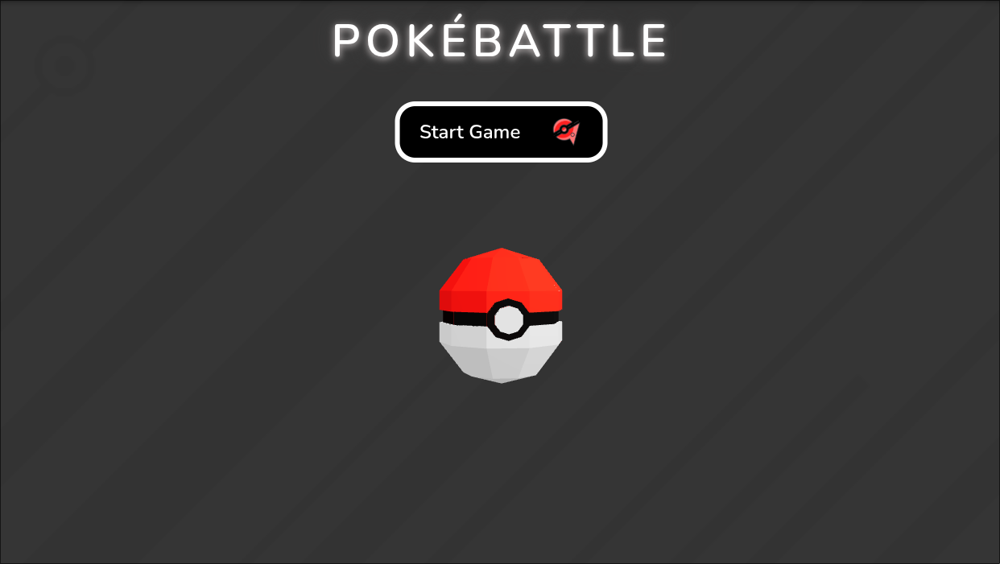
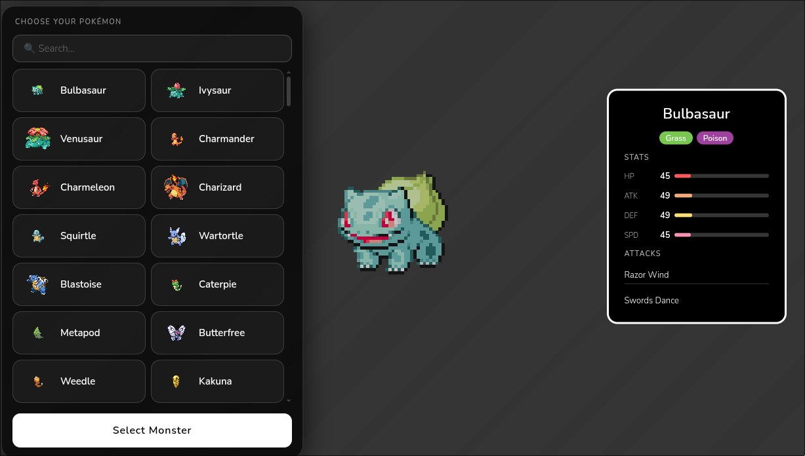
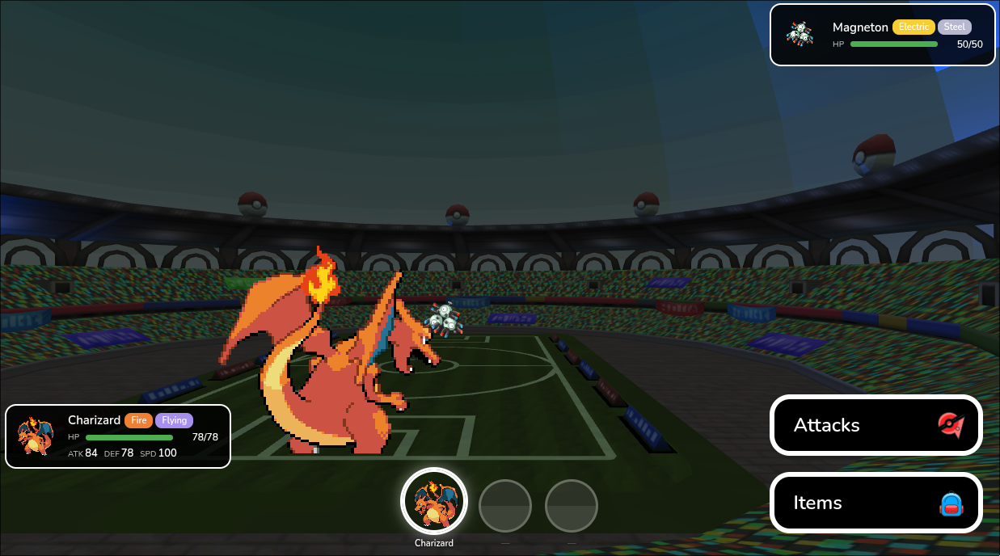

# Three.js Monster Arena — Pokébattle

A Pokémon-style turn-based battle game that runs entirely in the browser, built with Three.js and vanilla JavaScript.

**🎮 Play it here: [threejs-pokemon-arena.vercel.app](https://threejs-pokemon-arena.vercel.app/)**

## About

Pick your Pokémon from the full Gen-1 roster — stats, sprites, types, and moves are fetched live from [PokeAPI](https://pokeapi.co/) — and battle endless enemy parties in a 3D stadium. Damage follows the classic type-effectiveness chart, you earn items or new party members after each victory, and enemies scale in strength and party size as your win streak grows. Faint all your monsters and it's game over.

## Screenshots

<table>
  <tr>
    <td align="center"><b>Title screen</b></td>
    <td align="center"><b>Choose your Pokémon</b></td>
  </tr>
  <tr>
    <td></td>
    <td></td>
  </tr>
  <tr>
    <td colspan="2" align="center"><b>Battle arena</b></td>
  </tr>
  <tr>
    <td colspan="2" align="center"></td>
  </tr>
</table>

## Stack

- [Three.js](https://threejs.org/) — 3D rendering (stadium, sprites, shader-based battle animations)
- Vanilla JavaScript + native Web Components — UI without a framework
- [Vite](https://vitejs.dev/) — dev server and build
- [PokeAPI](https://pokeapi.co/) — live Pokémon data
- ESLint + Prettier — linting and formatting

## Running locally

```bash
npm install
npm run dev
```

Build for production:

```bash
npm run build
npm run preview
```
